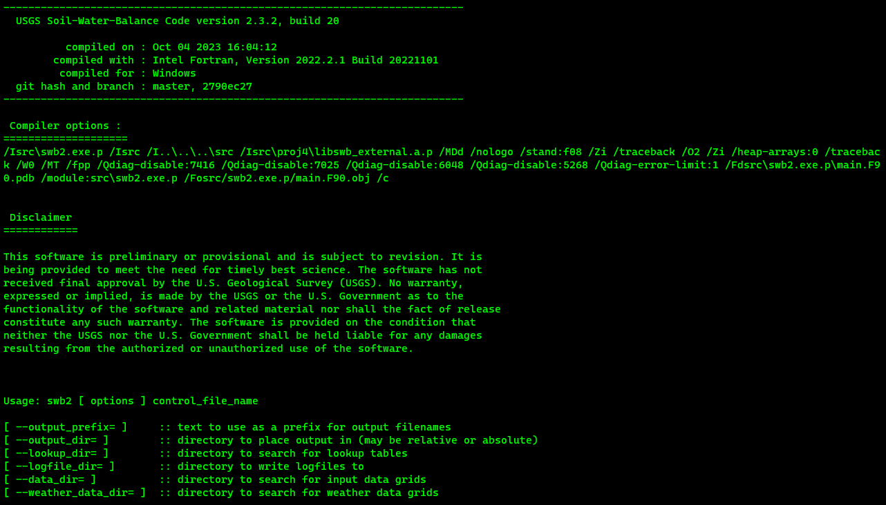

title: SWB Overview
ordered_subpage: control_file.md
ordered_subpage: lookup_tables_and_grids.md
ordered_subpage: daily_weather_data.md
ordered_subpage: projection_and_resampling.md
ordered_subpage: output_files.md
ordered_subpage: references.md
copy_subdir: images
---

@note
The official documentation for this code is contained in [USGS Techniques and Methods Report 6-A59](https://pubs.er.usgs.gov/publication/tm6A59). This online documentation is a work-in-progress. While we will try to keep this as up-to-date as possible, you may find occasionally find instances where the actual behavior of the code differs from the official documentation or from this online documentation. Please consider submitting an issue on the [GitHub repository](https://github.com/smwesten-usgs/swb2/issues) if you find such differences between code and documentation.
@endnote

## Installing and Running Soil-Water-Balance Version 2.0

SWB is compiled Fortran 2008 code; no installation is needed other than copying the executable program to the desired location on the system hard drive. When the name of the executable is typed at a terminal command prompt, SWB will start up, list the compilation date, list the Git commit hash and branch, and finally, list any options that may be invoked (fig 1). Git is a software tool designed to keep track of changes made to a source code such as SWB (Torvalds and Hamano, 2010). A Git commit hash is a symbol that uniquely identifies the state of the code modules used to compile the version of SWB the user is running. If a SWB run has issues, the Git commit hash is crucial for recreating the code as it existed during compilation. 

**Figure 1.**  Command-line response when Soil-Water-Balance (SWB) version 2.0 is
    executed with no other arguments.

### System Requirements

SWB compiles and runs on any modern hardware including Apple Macintosh, Linux, or Windows-based systems. Performance will generally be better on a system with greater processing speed and more random access memory (RAM). A small problem, consisting of a model domain of about 100 cells by 100 cells, will run on a small single-board computer such as a Raspberry Pi, albeit slowly.

SWB is able to access large gridded daily weather datasets by use of the netCDF library and will run efficiently by pulling out only the data needed for the simulation. It is possible to supply SWB with gridded weather data such as Daymet (Thornton and others, 2016) for the conterminous United States even if the model application area is only a few square kilometers; SWB will pull the local values as needed. However, a year of Daymet data covering the continental United States takes up almost 3 gigabytes (GB) of disk space; a simulation spanning from 1980 to 2018 would require more than 100 GB of disk storage for just the daily weather dataset. The authors have had success using Python packages such as xarray to effciently pare down continental-scale daily weather input netCDF files to a size covering local or regional SWB application areas.

Output from SWB is in the form of a compressed Network Common Data Form (netCDF) file (Unidata, 2014). A 346 by 400-cell example problem run with SWB for a 2-year period generates about 900 megabytes (MB) of file output. For a typical SWB simulation, a hard drive with empty space ranging from 100 GB or greater is recommended to accommodate the output files generated by SWB.

### Running SWB

SWB must be run from an operating system command line, with a control filename specified. If the command 'swb2' is entered at the command prompt without providing a control filename, SWB will print out some diagnostic information (fig 1.). The information includes the date of compilation and a Git hash that uniquely identifies the source code used in the compilation SWB also prints out a message that mentions three command-line options: --output_prefix, --output_dir, and --data_dir.

Within the control file, paths may be specified so that the input datasets may stay in their own dedicated space on the hard drive. SWB will use relative or absolute paths to files. The --output_prefix option allows the user to specify a text string that will be affixed to the front of each output file name. The --output_dir option allows the user to specify the location in which program output should be stored. The --data_dir option may be used to specify the location on the disk that SWB will search for input data.

If swb2 my_control_file.ctl --output_prefix=WI_ --output_dir=output --data_dir=input is entered at the command line, an SWB run will begin with whatever options are contained within the control file. Output files will be prefixed with the characters WI_ and saved in the output subdirectory, and the required data will be accessed in the input subdirectory.